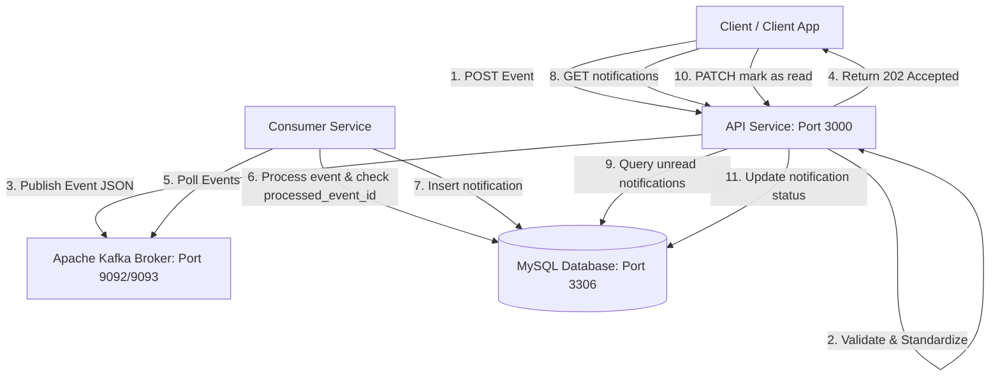

# Event-Driven Notification Service

An enterprise-ready, scalable, and fully containerized event-driven notification microservice architecture built with **Node.js/Express**, **Apache Kafka**, and **MySQL**.

This project implements an Event-Driven Architecture (EDA) where user activities (likes, comments) are processed asynchronously in real time. It enforces **idempotency** using a double-layered check: an application-level state check combined with a database-level UNIQUE constraint on the event ID.

---

## Architectural Overview



1. **API Service**: Receives client HTTP requests, validates the schema/structure, generates a unique `event_id` and publishes it to Apache Kafka.
2. **Apache Kafka**: Serves as the high-throughput, low-latency message broker storing activity events under the `user-activity` topic.
3. **Consumer Service**: Listens continuously to Kafka, parses events, converts them to structured messages, and processes them. It guarantees **Idempotency** (exactly-once processing) to prevent duplicate notifications.
4. **MySQL Database**: Stores persistent notifications with a state of `unread` or `read`.

---

## Tech Stack

*   **API Framework**: Node.js & Express.js
*   **Message Broker**: Apache Kafka (orchestrated via Confluent ZooKeeper & CP-Kafka)
*   **Database**: MySQL 8.0
*   **Libraries**:
    *   `kafkajs` (Kafka Client)
    *   `mysql2` (Database Connector)
    *   `uuid` (ID Generation)
    *   `jest` & `supertest` (Testing Frameworks)
*   **Deployment**: Docker & Docker Compose

---

## Quick Start & Setup

### Prerequisites
Make sure you have [Docker](https://docs.docker.com/) and [Docker Compose](https://docs.docker.com/compose/) installed on your machine.

### 1. Configure Environment Variables
Copy the `.env.example` file to `.env`:
```bash
cp .env.example .env
```

### 2. Spin Up Services
Run the following command to build and launch all containers (ZooKeeper, Kafka, MySQL, API Service, and Consumer Service):
```bash
docker-compose up -d --build
```

### 3. Verify Container Status
Check that all containers are healthy and running:
```bash
docker-compose ps
```
The health checks will guarantee that the API and Consumer services only launch after MySQL and Kafka are fully operational.

---

## API Specifications

### 1. Publish User Activity Event
Publish a social interaction (like a post or comment) to the event stream.

*   **Endpoint**: `POST /api/user-activity-events`
*   **Headers**: `Content-Type: application/json`
*   **Request Body**:
    ```json
    {
      "event_type": "user_liked_post",
      "payload": {
        "user_id": "test-user-1",
        "post_id": "post-123",
        "recipient_id": "test-user-2"
      }
    }
    ```
*   **Response**: `202 Accepted`
    ```json
    {
      "message": "Event published successfully",
      "event_id": "764b85c1-3d77-4b15-996c-8c08795fd810"
    }
    ```

### 2. Get User Notifications
Retrieve all pending unread notifications for a specific user.

*   **Endpoint**: `GET /api/users/{userId}/notifications`
*   **Response**: `200 OK`
    ```json
    [
      {
        "notification_id": "4020a597-9092-498c-9b16-cd34f40fbc0e",
        "recipient_user_id": "test-user-2",
        "event_type": "user_liked_post",
        "message_content": "Your post was liked by test-user-1.",
        "status": "unread",
        "created_at": "2026-06-16T15:23:44.000Z"
      }
    }
    ```

### 3. Mark Notification as Read
Mark a specific notification as read.

*   **Endpoint**: `PATCH /api/notifications/{notificationId}/read`
*   **Response**: `204 No Content`

---

## Schemas

### Kafka Message Schema
Events published to the `user-activity` Kafka topic strictly follow this format:
```json
{
  "event_id": "uuid-unique-for-this-event-instance",
  "timestamp": "ISO 8601 string",
  "source": "api-service",
  "event_type": "user_liked_post",
  "payload": {
    "user_id": "uuid-of-actor",
    "target_id": "uuid-of-target-entity-e.g.-post",
    "recipient_id": "uuid-of-user-to-notify",
    "comment_text": "Optional comment content"
  }
}
```

### MySQL Database Schema (`database/init.sql`)
```sql
CREATE TABLE IF NOT EXISTS notifications (
    notification_id VARCHAR(36) PRIMARY KEY,
    recipient_user_id VARCHAR(36) NOT NULL,
    event_type VARCHAR(50) NOT NULL,
    message_content TEXT NOT NULL,
    status ENUM('unread', 'read') DEFAULT 'unread',
    created_at TIMESTAMP DEFAULT CURRENT_TIMESTAMP,
    processed_event_id VARCHAR(36) UNIQUE NOT NULL
);
```

---

## Running Tests

You can run unit test suites either inside Docker containers or on your local machine.

### Running Inside Docker
```bash
# API Service tests
docker-compose exec api-service npm test

# Consumer Service tests
docker-compose exec consumer-service npm test
```

### Running Locally
```bash
# Inside api-service directory
cd api-service && npm install && npm test

# Inside consumer-service directory
cd consumer-service && npm install && npm test
```
