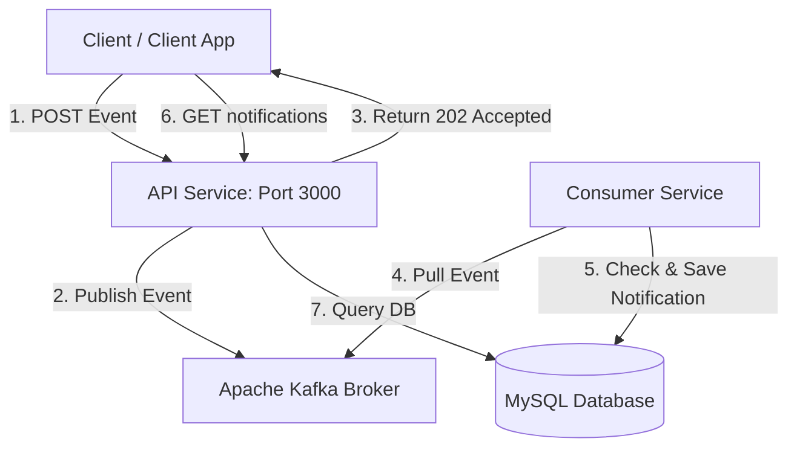

# Event-Driven Notification Service

This is a simple notification system that processes user activities (like post likes or comments) asynchronously in the background. It consists of an API service, a Kafka message broker, a consumer worker, and a MySQL database.

By using Kafka as a buffer, the API doesn't block waiting for notifications to be created. It immediately returns a success status to the user, and the background worker processes the event and saves the notification in the database.

---

## How It Works

Here is a quick flow of how an event becomes a notification:



1. **Client** publishes an activity (like a "like" or "comment") to the API Service.
2. **API Service** validates the payload, generates a unique ID for the event, pushes it to Kafka, and immediately tells the client: "Got it!" (202 Accepted).
3. **Consumer Service** reads events from Kafka, turns them into user-friendly notification messages, and saves them to MySQL. It ensures that even if Kafka delivers the same event twice, we only save it once (idempotent processing).
4. **Client** can then fetch their unread notifications or mark them as read via the API.

---

## Getting Started

### Prerequisites
You'll need [Docker](https://docs.docker.com/) and [Docker Compose](https://docs.docker.com/compose/) installed.

### 1. Set up environment variables
Copy the template environment file:
```bash
cp .env.example .env
```

### 2. Start the services
Run the following command to build and start all containers (Kafka, Zookeeper, MySQL, API, and the Consumer):
```bash
docker compose up -d --build
```
*(If you are on an older Docker version, you might need to run `docker-compose up -d --build` instead).*

### 3. Check if everything is running
To see the status of your containers, run:
```bash
docker compose ps
```
The services are configured to wait until MySQL and Kafka are healthy before they start processing requests.

---

## Testing it Out

You can test the entire flow using these `curl` commands in your terminal:

### 1. Send an activity event
Let's pretend `test-user-1` liked a post belonging to `test-user-2`:
```bash
curl -X POST http://localhost:3000/api/user-activity-events \
  -H "Content-Type: application/json" \
  -d '{
    "event_type": "user_liked_post",
    "payload": {
      "user_id": "test-user-1",
      "post_id": "post-123",
      "recipient_id": "test-user-2"
    }
  }'
```
You should get a `202 Accepted` response with an `event_id`.

### 2. Retrieve notifications for the recipient
Now, check if `test-user-2` received the notification:
```bash
curl http://localhost:3000/api/users/test-user-2/notifications
```
You should see a list of notifications, including the one we just generated (e.g., *"Your post was liked by test-user-1"*). Note the `notification_id` from the response.

### 3. Mark the notification as read
Using the `notification_id` from the previous step, mark it as read:
```bash
# Replace <notification_id> with the actual ID returned from the previous step
curl -X PATCH http://localhost:3000/api/notifications/<notification_id>/read
```
This will return a `204 No Content` status, meaning the notification is now marked as read.

---

## Running Tests

If you want to run the test suite, you can do so either inside the running Docker containers or locally on your machine.

### Inside Docker
```bash
# Run API Service tests
docker compose exec api-service npm test

# Run Consumer Service tests
docker compose exec consumer-service npm test
```

### Locally
Ensure you run `npm install` first in each directory:
```bash
# API Service
cd api-service && npm install && npm test

# Consumer Service
cd consumer-service && npm install && npm test
```

---

## Want to Know More?
For detailed information on the system architecture, database schema design, and how we handle duplicate messages (idempotency), check out [ARCHITECTURE.md](ARCHITECTURE.md).
