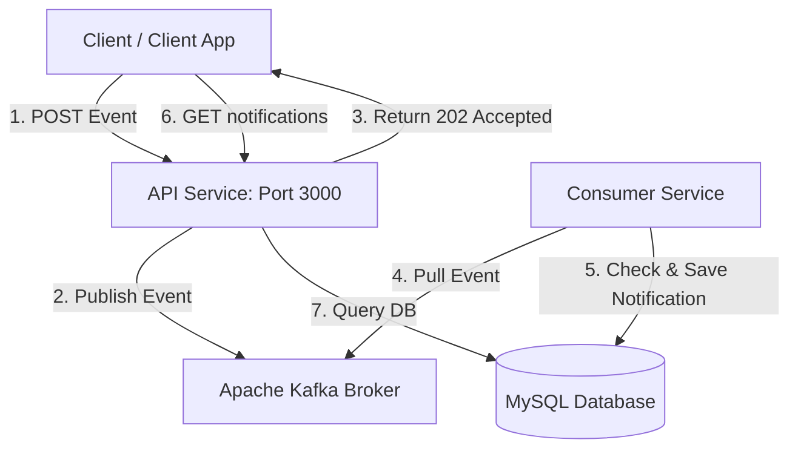

# Event-Driven Notification Service

This is a simple system that handles user activity events (like liking a post or adding a comment) and processes them in the background to create notifications. 

Instead of making the user wait while we generate and save notifications, the API publishes events to a Kafka broker and immediately returns a `202 Accepted` response. A separate background worker (the Consumer Service) pulls these events from Kafka and saves them to a MySQL database.

---

## System Flow

Here is how an event becomes a notification:



1. **Client** sends a request with the user activity to the API.
2. **API Service** validates the input, generates a unique event ID, pushes it to Kafka, and immediately replies with `202 Accepted`.
3. **Consumer Service** pulls the event from Kafka, generates a friendly notification message, and saves it to MySQL. (It handles duplicate events safely so we don't spam the user).
4. **Client** can then fetch their notifications or mark them as read via the API.

---

## Setup & Running

### Prerequisites
You'll need [Docker](https://docs.docker.com/) and [Docker Compose](https://docs.docker.com/compose/) installed.

### 1. Configure the Environment
Copy the example environment file to create your `.env` file:
```bash
cp .env.example .env
```

### 2. Start the Services
Run this command to build and start Zookeeper, Kafka, MySQL, the API, and the Consumer:
```bash
docker compose up -d --build
```
The services will wait for MySQL and Kafka to be healthy before starting up.

---

## How to Test It (cURL / Postman)

All API requests go through port `3000`.

### 1. Send an Event
Simulate `test-user-1` liking a post owned by `test-user-2`:
```bash
curl -X POST http://localhost:3000/api/user-activity-events \
  -H "Content-Type: application/json" \
  -d '{
    "event_type": "user_liked_post",
    "payload": {
      "user_id": "test-user-1",
      "post_id": "post-123",
      "recipient_id": "test-user-2"
    }
  }'
```
You'll get back a `202 Accepted` response with an `event_id`.

### 2. Fetch Notifications
Check if the notification was generated for `test-user-2`:
```bash
curl http://localhost:3000/api/users/test-user-2/notifications
```
This returns a list of unread notifications, including the one we just triggered. Note down the `notification_id` from the response.

### 3. Mark as Read
Use the `notification_id` to mark it as read:
```bash
curl -X PATCH http://localhost:3000/api/notifications/<notification_id>/read
```
This returns a `204 No Content` status, confirming the notification is now marked as read.

---

## Running the Tests

You can run the unit test suite either inside the Docker containers or locally.

### Inside Docker
```bash
# Test API Service
docker compose exec api-service npm test

# Test Consumer Service
docker compose exec consumer-service npm test
```

### Locally
Make sure to install dependencies first:
```bash
# API Service
cd api-service && npm install && npm test

# Consumer Service
cd consumer-service && npm install && npm test
```

---

## Under the Hood
For details on system architecture, database index optimization, and the two-layer idempotency strategy (exactly-once semantics), check out [ARCHITECTURE.md](ARCHITECTURE.md).
